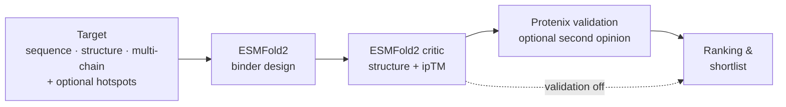
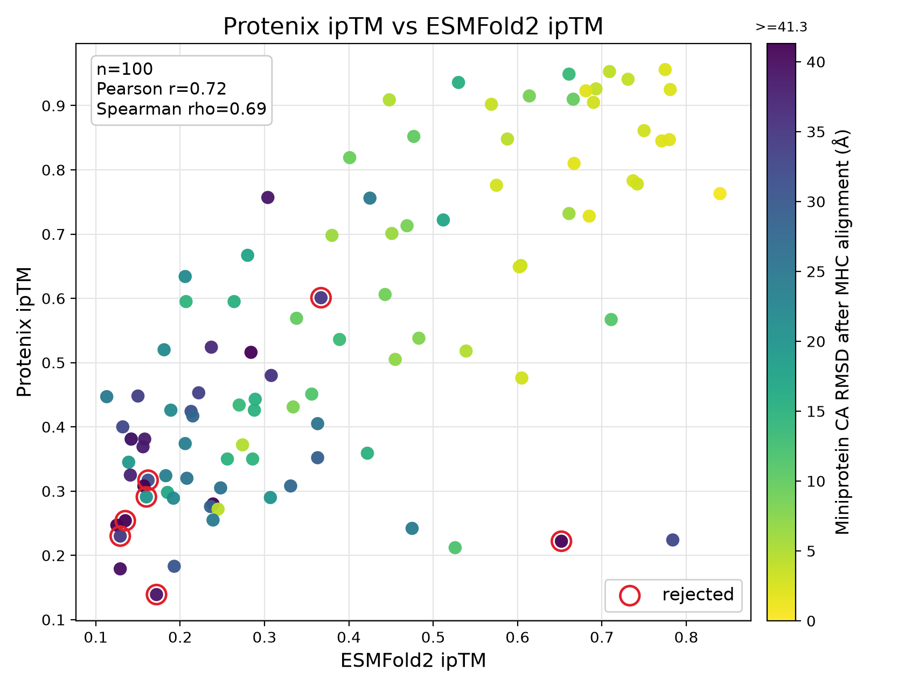
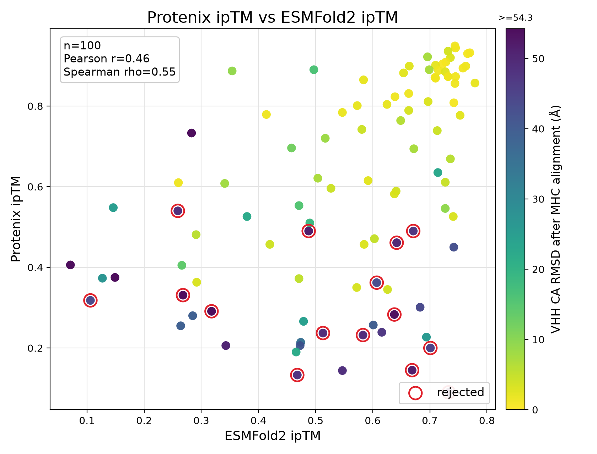

# ESMFold2 Pipeline


**Design protein binders against your target with ESMFold2 — at campaign scale.**
ESMFold2 Pipeline turns the [ESM cookbook](https://github.com/Biohub/esm)
binder-design tutorial into a configurable pipeline for real miniprotein, scFv,
and VHH campaigns: give it a target (a sequence or a structure), point it at the
epitope you care about, and it generates, scores, validates, and ranks binder
designs across your GPUs.



## Contents

- [What is this?](#what-is-this)
- [Highlights](#highlights)
- [How it works](#how-it-works)
- [Quickstart](#quickstart)
- [Design modalities](#design-modalities)
- [Results](#results)
- [Ranking](#ranking)
- [Output at a glance](#output-at-a-glance)
- [Documentation](#documentation)
- [Current limitations](#current-limitations)
- [License](#license)
- [Built on](#built-on)

## What is this?

The [ESM cookbook](https://github.com/Biohub/esm) from the ESM team provides an
excellent binder-design method and a tutorial that demonstrates it — the
foundation this project builds on. The cookbook is ideal for learning the method
and exploring designs interactively.

ESMFold2 Pipeline extends that method into a tool for running production design
campaigns. You describe a campaign in a short YAML file (or a single command),
and the pipeline generates binder designs, scores them, optionally validates them
with an independent structure predictor, and hands you a ranked shortlist ready
for the bench — for miniprotein, scFv, and VHH binders alike.

It is built to run **hundreds to thousands of designs in parallel — across all
your GPUs by default, or a subset you choose — and to resume cleanly after any
interruption**, so launching a full campaign is a single command. The
orchestration internals stay out of your way (and live in the code for anyone
who wants them).

## Highlights

Built on the ESM design method, and incorporating antibody-targeting concepts
from [escalante-bio/mosaic](https://github.com/escalante-bio/mosaic), this
pipeline adds:

- **Structural template inputs.** Design against a real PDB/mmCIF target, and
  build antibodies on real clinical framework **structures** (scFv VH–VL and VHH
  coordinates), not just sequences.
- **Multi-chain target support.** Target complexes and assemblies, not just a
  single chain, with optional chain-pair geometry conditioning.
- **Hotspot / epitope targeting.** Steer designs toward specific target residues
  and gate the final selection on real hotspot contact. For scFv and VHH
  campaigns, an optional Mosaic-style CDR contact mode can make CDRs carry the
  binder-target attraction, with an optional framework contact penalty.
- **Distogram conditioning.** Inject the target's own geometry as a structural
  prior during both design and scoring; partial templates handle unresolved
  residues automatically.
- **Automatic MSA handling & reuse.** Validation prefetches, caches, and reuses
  target and binder MSAs across designs and resumes — rate-limited so you never
  hammer the MSA server.
- **Evaluator-aware consensus ranking.** Preserve ESMFold2 selection provenance,
  then combine ESMFold2 and scoped validator confidence with a configurable
  target-aligned binder RMSD gate and agreement contribution.
- **Clinical antibody framework panels.** Structurally-backed scFv (clinical mAb)
  and VHH panels, ready to sweep many frameworks in a single campaign.
- **Parallel, resumable campaigns on your own hardware.** Run hundreds to
  thousands of designs across your GPUs — all of them by default, or specific
  ones you select — and resume cleanly after any interruption.

## How it works

Every campaign runs the four stages in the diagram above:

1. **Design** — for each requested candidate, ESMFold2 generates a binder against
   your target. Designs can be steered toward chosen hotspot residues and
   conditioned on the target's own structure (see [Highlights](#highlights)).
2. **Critic** — each design is re-folded in complex with the target and scored,
   most importantly by interface **ipTM** — a confidence proxy for whether the
   binder actually engages the target.
3. **Validate (optional)** — selected designs are re-predicted with
   [Protenix](guide/validation.md) for an orthogonal structural opinion (ipTM,
   ipSAE, and RMSD against the ESMFold2 model), with MSAs fetched and reused
   automatically.
4. **Rank & select** — without a validator, designs retain their ESMFold2 ipTM
   rank. With Protenix, final ranking combines ESMFold2 ipTM, scoped Protenix
   ipTM/ipSAE, and target-aligned binder RMSD, then exports paired structures as
   a clean shortlist.

Campaigns run **in parallel across your GPUs — all of them by default, or a
subset you choose with `--gpus` — and are fully resumable**: rerun the same
command after an interruption and it picks up where it left off without repeating
finished work. Operators who want the scheduling details (shard lifecycle,
retries, heartbeats) can find them in the
[CLI reference](guide/cli-reference.md#multi-gpu-execution).

## Quickstart

> **Requirements:** a CUDA-capable NVIDIA GPU (80 GB strongly recommended) and a
> Linux GPU host with Python 3.12. Tested on H100, H200, A100, and Blackwell
> (RTX PRO 6000 Blackwell, B200, B300) GPUs with CUDA 12.8+. Full hardware,
> disk, and installer detail in the [installation guide](guide/installation.md).

**1. Install** — clones ESM, builds isolated `uv` environments, installs the
optional Protenix validation runtime, and preloads the common ESMFold2
checkpoints (no `sudo`, no system Python changes):

```bash
git clone https://github.com/cytokineking/esmfold2-pipeline.git
cd esmfold2-pipeline
./install.sh
source "$HOME/esmfold2/env.sh"
```

**2. Confirm your setup** with one quick design (direct target sequence,
`miniprotein` scaffold, fast model, 2 steps):

```bash
uv run esmfold2-pipeline check-env --esm-repo "$ESM_REPO"

uv run esmfold2-pipeline launch \
  --target-name toy_target \
  --target-sequence ACDEFGHIKLMNPQRSTVWY \
  --scaffold miniprotein \
  --num-designs 1 --steps 2 --model fast-cutoff2025 \
  --out runs/gpu-check --esm-repo "$ESM_REPO" --gpu-id 0

uv run esmfold2-pipeline status runs/gpu-check
```

This runs one real design end to end — model loading, design, folding, and
scoring — to confirm your environment and GPU work. It is a quick check, not a
production campaign.

On a fresh machine, the first installer, preflight, launch, or Protenix
validation run can spend several minutes downloading checkpoints, loading large
weights, and compiling CUDA extensions before GPU utilization looks steady.
Later runs against the same environment are much faster.

**3. Run a real campaign.** `--gpus all` uses every visible GPU; pass
`--gpus 0,1` or `--gpus 0-3` to select specific ones:

```bash
uv run esmfold2-pipeline launch \
  --target-name custom_antigen \
  --target-sequence ACDEFGHIKLMNPQRSTVWY \
  --scaffold miniprotein \
  --num-designs 100 --length 65-150 --steps 150 --model cutoff2025 \
  --out runs/custom-antigen-n100 --esm-repo "$ESM_REPO" --gpus all
```

For custom frameworks, conditioning overrides, or advanced loss settings, write
a YAML config and `launch config.yaml` instead — see the
[configuration reference](guide/configuration.md) and
[`example_configs/`](example_configs/). `launch` writes the final metrics,
shortlist, selected structure copies, and, when the YAML has a `validation`
block, Protenix validation and analysis outputs. To resume, rerun the same YAML
config or point `launch` at the existing campaign directory; if a different
config points at the same output directory, `launch` rejects it instead of
mixing runs. For YAML-free launches, resume with `launch runs/custom-antigen-n100`
after the first command has created the campaign directory. For operator control
over each stage, use the explicit `check` → `plan` → `run-multi` → `aggregate`
→ `select` → `export` lifecycle in the
[CLI reference](guide/cli-reference.md).

## Design modalities

One campaign surface covers three binder types. `num_designs` is always the
total candidate count; for antibody scaffolds it is split round-robin across the
chosen frameworks.

| Scaffold | What it designs | Frameworks |
| --- | --- | --- |
| `miniprotein` | De novo miniprotein binders, length-sampled | n/a |
| `scfv` | scFv binders on a clinical VH-linker-VL framework | [panel ↗](src/esmfold2_pipeline/frameworks/scfv/README.md) |
| `vhh` | Single-domain (VHH / nanobody) binders | [panel ↗](src/esmfold2_pipeline/frameworks/vhh/README.md) |

<details>
<summary><b>Structure target with hotspots (miniprotein)</b></summary>

```bash
uv run esmfold2-pipeline launch \
  --target-name il2rb \
  --target-structure /path/to/target.cif \
  --chains A --hotspot A:88,91 \
  --scaffold miniprotein \
  --num-designs 100 --length 65-150 --steps 150 --model cutoff2025 \
  --out runs/il2rb-hotspot-n100 --esm-repo "$ESM_REPO" --gpus all
```

Hotspots steer designs toward an epitope and gate the final selection. Details:
[Structure targets & hotspots](guide/structure-targets.md).
</details>

<details>
<summary><b>scFv campaign (clinical framework sweep)</b></summary>

```bash
uv run esmfold2-pipeline launch \
  --target-name custom_antigen_scfv \
  --target-sequence ACDEFGHIKLMNPQRSTVWY \
  --scaffold scfv --frameworks all \
  --num-designs 300 --steps 150 --model cutoff2025 \
  --out runs/custom-antigen-scfv-n300 --esm-repo "$ESM_REPO" --gpus all
```

`--frameworks all` round-robins across every bundled framework. Use
`--frameworks trastuzumab,atezolizumab` for a subset.
</details>

<details>
<summary><b>VHH campaign (single-domain)</b></summary>

```bash
uv run esmfold2-pipeline launch \
  --target-name custom_antigen_vhh \
  --target-sequence ACDEFGHIKLMNPQRSTVWY \
  --scaffold vhh --frameworks caplacizumab,vobarilizumab_il6r \
  --num-designs 300 --steps 150 --model cutoff2025 \
  --out runs/custom-antigen-vhh-n300 --esm-repo "$ESM_REPO" --gpus all
```

VHH reuses the antibody framework-template path and reports designed CDRs as
heavy-chain columns. VHH and scFv campaigns default to the Mosaic-style
`mosaic_cdr` contact mode, replacing the legacy whole-binder target attraction
with a CDR-scoped contact loss. Add
`--mosaic-framework-contact-penalty-weight` only when you explicitly want to
discourage framework-mediated target contacts; `1.0` is a reasonable starting
weight for that penalty.
</details>

## Results

Why a second model helps. Each point below is one design from an example
campaign targeting the **KRAS-G12C peptide VVVGACGVGK presented by HLA-A\*11:01**,
with the peptide set as the design hotspot (100 designs each, `fast-cutoff2025`):
**ESMFold2 (design-time) ipTM vs Protenix (independent validator) ipTM, colored
by binder Cα RMSD between the two predicted complexes** (after aligning on the
MHC).

Confidence from both models is strongest evidence when it is coupled to low
RMSD (bright); high ipTM from one model alone does not guarantee the same binding
pose. Agreement between an in-house design model and an independent structure
predictor is therefore a hit-selection signal that neither score gives on its
own. Validator-rejected designs are marked with red rings.

| Miniprotein | VHH |
| :---: | :---: |
|  |  |
| Design and validation ipTM correlate (Pearson r≈0.72); the brightest, lowest-RMSD designs concentrate in the high-confidence corner. | Same pattern for VHH — the high-confidence corner is tightly aligned (the brightest designs converge on the native pose). |

## Ranking

The pipeline keeps pre-validation selection separate from final hit ranking:

- **Without an evaluator**, `rank` is the ESMFold2 selection order: scoped
  binder-target ipTM first, followed by the relevant distogram contact proxy.
- **With an evaluator**, `selection_rank` preserves that ESMFold2 order and
  determines which designs are sent to validation. `final_rank` is calculated
  after validation and is the rank used in `ranked_results/top_ranked/`
  filenames. The compact CSV exposes these as `esmfold2_rank` and `rank`, with
  `validator_rank` showing the evaluator-only confidence order between them.

By default, final-ranking eligibility requires a completed, passing validator
result, the required scoped confidence metrics, and target-aligned binder Cα
RMSD at or below **2.5 Å**. `combined_ranking.csv` contains only eligible
designs. Ineligible rows remain available in `ranking_diagnostics.csv`, with
`ranking_exclusion_reason` explaining why.

For eligible designs, the default consensus rank is:

```text
evaluator_score = sqrt(validator_iptm * validator_ipsae)

confidence_score =
    esmfold2_iptm^0.50
  * validator_iptm^0.25
  * validator_ipsae^0.25

agreement_score = exp(-0.5 * (binder_rmsd / 2.5)^2)

final_score = confidence_score^0.90 * agreement_score^0.10
```

If ipSAE is unavailable and was not required by a validation threshold, scoped
validator ipTM is used alone for `evaluator_score`. `pareto_front` reports
non-dominated ESMFold2/evaluator confidence tiers for inspection; it is not a
hidden sort key. The deterministic final order is eligibility, `final_score`,
lower RMSD, evaluator score, and ESMFold2 ipTM.

Configure the gate and RMSD contribution in YAML:

```yaml
analysis:
  top_k: 100
  ranking:
    mode: auto
    max_binder_rmsd_angstrom: 2.5
    rmsd_weight: 0.10
```

Set `rmsd_weight: 0` for gate-only behavior. Set both
`max_binder_rmsd_angstrom: null` and `rmsd_weight: 0` to make RMSD optional.
Existing completed campaigns can be reranked without rerunning either model:

```bash
uv run esmfold2-pipeline analyze /path/to/campaign --top-k 100
```

## Output at a glance

Every campaign is a self-contained directory: designed structures, metrics
tables, the ranked shortlist, and (when enabled) validation results, all in one
place.

<details>
<summary>Campaign directory tree</summary>

```text
campaign/
  config.yaml
  resolved_config.yaml
  campaign.sqlite
  target/                      # structure-derived targets only
  logs/
    design_workers/
    validation_workers/
  esmfold2/
    structures/                # predicted complex PDBs
    metrics_all.csv            # aggregate
    selected_designs.csv       # select
    selected_structures/       # export
  validation/
    protenix_v2/
      validation_results.csv
  ranked_results/
    combined_ranking.csv
    ranking_diagnostics.csv
    top_ranked/
      esmfold2/                # rank0001_<candidate>_esmfold2.pdb …
      protenix_v2/             # rank0001_<candidate>_protenix_v2.cif …
```

Full annotated tree and per-file notes: [Output layout](guide/outputs.md).
</details>

Run `status` any time to reconcile the database against expected artifacts; it
exits nonzero and reports the issue if anything is missing or untracked.

## Documentation

| Guide | What's inside |
| --- | --- |
| [Installation & requirements](guide/installation.md) | Hardware, disk, installer flags, model preload, Protenix runtime. |
| [YAML configuration reference](guide/configuration.md) | Every config field, frameworks, analysis ranking, recommended defaults. |
| [CLI reference](guide/cli-reference.md) | All commands and flags, multi-GPU execution, resume recovery, dev checks. |
| [Structure targets & hotspots](guide/structure-targets.md) | Target modes, hotspots, indexing, distogram conditioning. |
| [Optional Protenix validation](guide/validation.md) | Post-critic validation, consensus ranking, and reranking. |
| [Runtime & scaling](guide/runtime-and-scaling.md) | Preprint scale, compute estimates, campaign progression. |
| [Output layout](guide/outputs.md) | Campaign tree, rank field semantics, and per-file notes. |

## Current limitations

- Direct `target.sequence` input supports one target chain; use
  `target.structure` for multichain targets.
- Exactly one critic per campaign.
- `select` does not yet compute or filter on pI (apply the preprint's minibinder
  pI > 6.0 filter externally for now — see [runtime & scaling](guide/runtime-and-scaling.md)).
- Protenix validation covers miniprotein, VHH, and built-in scFv campaigns with
  bundled structural templates; custom scFv frameworks need explicit
  structural-template or paired VH/VL MSA support.
- Local GPU execution is the supported path; cloud execution is not the primary
  interface.

## License

Source-available under the **Elastic License 2.0** (`Elastic-2.0`). It permits
royalty-free commercial use,
including internal pharma/biotech research, development, production, and
deployment on your own hardware or cloud. The main restriction: you may not
provide the software (or a service exposing a substantial set of its
functionality) to third parties as a hosted or managed service without an
agreement from the copyright holder. See [LICENSE](LICENSE).

## Built on

- **[Biohub ESM](https://github.com/Biohub/esm)** — the ESMFold2 model/runtime
  and the binder-design cookbook tutorial this pipeline is derived from.
- **[cytokineking/Protenix](https://github.com/cytokineking/Protenix)** — the
  template-capable Protenix fork used for optional structural validation.
- scFv framework provenance:
  [Thera-SAbDab](https://opig.stats.ox.ac.uk/webapps/sabdab-sabpred/therasabdab/search/?all=true).
