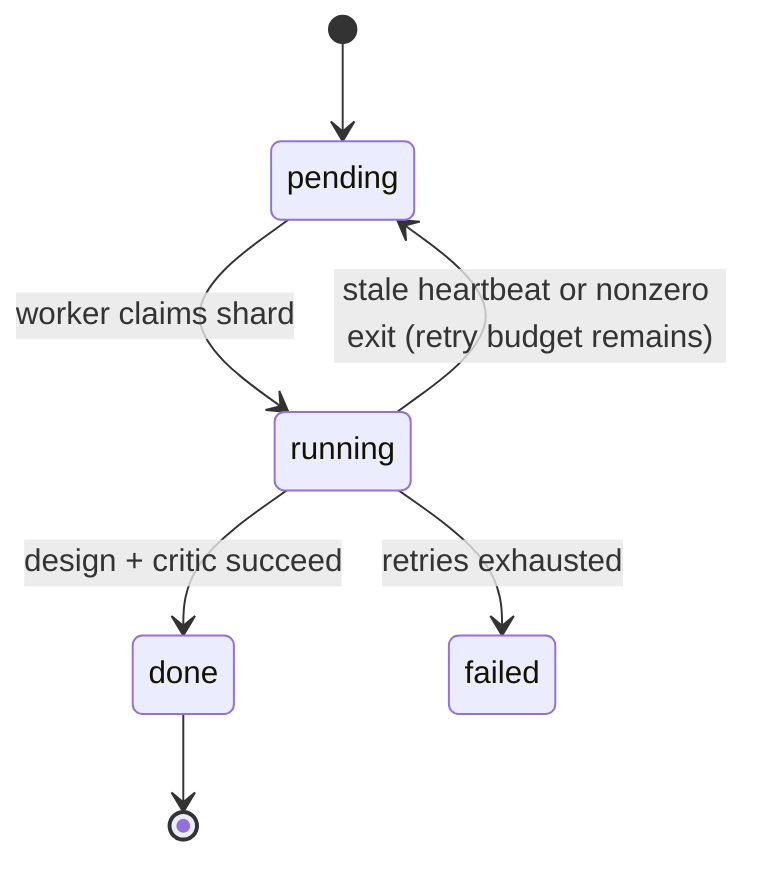

# CLI Reference

[← Back to README](../README.md) · [Documentation index](README.md)

All commands are invoked as `uv run esmfold2-pipeline <command> ...`.

## Start here: `launch`

**Most campaigns are a single command: `launch`.** It runs the whole flow end to
end — validate the config, plan the campaign, generate every design, score each
one with the ESMFold2 critic, aggregate metrics, select/export the shortlist,
and run validation/analysis when the config has a `validation` block — on a
single GPU or across many (pass `--gpus`; see
[Multi-GPU execution](#multi-gpu-execution)). You do **not** need `run-multi`
for a multi-GPU campaign; `launch --gpus ...` handles it.

`launch` accepts a YAML config:

```bash
uv run esmfold2-pipeline launch config.yaml --esm-repo "$ESM_REPO" --gpus all
```

or, for simpler campaigns, no YAML at all — describe the target and binder with
flags and `launch` writes the config for you before running:

```bash
uv run esmfold2-pipeline launch \
  --target-sequence ACDEFGHIKLMNPQRSTVWY --scaffold miniprotein \
  --num-designs 100 --steps 150 --out runs/demo \
  --esm-repo "$ESM_REPO" --gpus all
```

The YAML-free flags (`--target-sequence`, `--target-structure`, `--scaffold`,
`--frameworks`, `--hotspot`, `--length`, `--num-designs`, `--steps`, `--model`)
are listed under [Useful flags](#useful-flags). To add an independent structural
check to a YAML campaign, add a `validation` block; see
[Protenix validation](validation.md).

To resume an existing campaign and regenerate downstream outputs, point
`launch` at the campaign directory:

```bash
uv run esmfold2-pipeline launch /path/to/runs/my-campaign-n100 \
  --esm-repo "$ESM_REPO" --gpus all
```

You can also rerun the same YAML config:

```bash
uv run esmfold2-pipeline launch config.yaml --esm-repo "$ESM_REPO" --gpus all
```

If `config.yaml` resolves to an existing output directory with `campaign.sqlite`,
`launch` resumes that campaign as long as the semantic config matches. A
different config pointed at the same output directory is rejected instead of
mixing runs.

For YAML-free campaigns, the first `launch --target-sequence ... --out runs/demo`
writes `config.yaml` and `resolved_config.yaml` into `runs/demo`. Resume with
the campaign directory form:

```bash
uv run esmfold2-pipeline launch runs/demo --esm-repo "$ESM_REPO" --gpus all
```

Resume mode accepts runtime and final-output flags such as `--gpus`,
`--gpu-id`, `--max-designs`, `--skip-validation`, and `--analysis-top-k`, but
not `--out` or YAML-free target/scaffold flags. Those would describe a new
campaign rather than the existing one.

## Core commands

`launch` runs the commands below for you. They are also exposed individually for
when you want manual control over a single step.

| Command | Purpose |
| --- | --- |
| `launch [config.yaml\|CAMPAIGN_DIR]` | **The all-in-one.** Validate, plan, design, score, aggregate, select, export, and optionally validate/analyze a campaign. Also resumes an existing campaign directory. Single- or multi-GPU. |
| `check config.yaml` | Validate a config without creating campaign state. |
| `plan config.yaml` | Create `campaign.sqlite` and expand the campaign into one shard (task) per design. |
| `run CAMPAIGN_DIR` | Run pending designs on one local GPU. |
| `run-multi CAMPAIGN_DIR` | Run pending designs across several GPUs (one worker per GPU). |
| `status CAMPAIGN_DIR` | Show progress, per-design state, attempts, and artifact issues. |
| `aggregate CAMPAIGN_DIR` | Write `esmfold2/metrics_all.csv`. |
| `select CAMPAIGN_DIR` | Deduplicate and rank completed designs into `esmfold2/selected_designs.csv`. |
| `export CAMPAIGN_DIR` | Copy the selected structures into `esmfold2/selected_structures/`. |

`plan` prints the resolved campaign directory and example `run`, `run-multi`,
and `status` commands so you do not have to copy the output path from YAML.

### Running the steps manually

`launch` is the recommended path. Run the lifecycle yourself only when you want
to separate validation, planning, and execution — for example, to validate and
plan on a login node, then execute on GPU nodes:

```bash
uv run esmfold2-pipeline check config.yaml \
  --esm-repo "$ESM_REPO" \
  --env \
  --models \
  --gpu-id 0

uv run esmfold2-pipeline plan config.yaml

uv run esmfold2-pipeline run-multi \
  /path/to/runs/my-campaign-n100 \
  --esm-repo "$ESM_REPO" \
  --gpus 0-3

uv run esmfold2-pipeline status /path/to/runs/my-campaign-n100
uv run esmfold2-pipeline aggregate /path/to/runs/my-campaign-n100
uv run esmfold2-pipeline select /path/to/runs/my-campaign-n100 --max-designs 84
uv run esmfold2-pipeline export /path/to/runs/my-campaign-n100
```

## Preflight and validation commands

| Command | Purpose |
| --- | --- |
| `check-env` | Verify ESM, Torch, CUDA, and, by default, the local ESM runtime APIs used by the local design loop. With `ESMFOLD2_PIPELINE_DESIGN_BACKEND=tutorial`, verify the ESM cookbook tutorial file instead. |
| `check-models` | Load the configured model set on a GPU. Uses the selected design backend. |
| `check-protenix` / `validate-check-env` | Verify optional Protenix validation dependencies. |
| `validate-conditioning` | Fold-only GPU validation for target distogram conditioning. |
| `validate-plan CAMPAIGN_DIR` | Plan optional Protenix validation tasks from completed critic rows. |
| `validate-msa-plan CAMPAIGN_DIR` | Enqueue Protenix MSA prefetch jobs from completed critic rows. |
| `validate-msa-run CAMPAIGN_DIR` | Run rate-limited Protenix MSA prefetch jobs. |
| `validate-msa-retry CAMPAIGN_DIR` | Reset failed Protenix MSA jobs to pending for operator retry. |
| `validate-run CAMPAIGN_DIR` | Run pending Protenix validation tasks on one GPU. |
| `validate-run-multi CAMPAIGN_DIR --gpus all` | Start one Protenix validation worker per GPU. |
| `validate-report CAMPAIGN_DIR` | Write validation results and structure samples under `validation/{model}/`. |
| `analyze CAMPAIGN_DIR` | Rank validated designs and copy top-k paired structures under `ranked_results/`. |
| `validate CAMPAIGN_DIR` | Thin wrapper for MSA prefetch, validation planning/running, report generation, and analysis ranking. |

See [Validation](validation.md) for the full Protenix validation lifecycle.

Developer-only mock commands also exist (`plan-mock`, `run-mock`) for testing the
SQLite/artifact contract without a GPU. See [Development checks](#development-checks).

## Useful flags

"Required" is per command; "Default" is the effective default applied when the
flag is omitted. The most-used flags first.

| Command(s) | Flag | Required | Default | Meaning |
| --- | --- | --- | --- | --- |
| `launch`, `run`, `run-multi`, `check`, `check-env`, `check-models` | `--esm-repo PATH` | yes (or `ESM_REPO` env) | — | Path to the local ESM checkout. |
| `check`, `plan`, `launch` | `--out PATH` | no-YAML launch | YAML `output` | Campaign directory; overrides `output` from the config. Not valid when resuming `launch CAMPAIGN_DIR`. |
| `launch` | `--gpus 0,1 \| 0-3 \| all` | no | single GPU | GPUs to use: comma-separated ids, inclusive ranges, or `all` visible. Omit for a single GPU; runs one worker per GPU. |
| `run-multi` | `--gpus 0,1 \| 0-3 \| all` | yes | — | GPUs to use (`run-multi` requires it). One worker per GPU. |
| `launch`, `run`, `check-models`, `validate-conditioning` | `--gpu-id ID` | no | default device | Run on one specific GPU. Mutually exclusive with `--gpus`. |
| `check-models`, `launch` | `--model ALIAS_OR_NAME` | no | `cutoff2025` | ESMFold2 weights. Aliases: `cutoff2025`, `fast-cutoff2025`, `experimental`, `fast`. |
| `launch`, `run` | `--max-shards N` | no | all | Stop after N designs. Useful for a pilot run. |
| `launch`, `run-multi` | `--max-shards-per-worker N` | no | all | Stop each worker after N designs. |
| `launch`, `run`, `run-multi` | `--heartbeat-interval SECONDS` | no | `30` | Heartbeat write interval while a GPU job is active. |
| `launch`, `run`, `run-multi` | `--stale-timeout SECONDS` | no | `max(90, 3×heartbeat)` | When an abandoned running design is reclaimed for resume. |
| `check`, `check-models`, `launch`, `run`, `run-multi` | `--enable-hf-xet` | no | off | Do not force `HF_HUB_DISABLE_XET=1` during model loading. |
| `check` | `--env` | no | off | Also check ESM / Torch / CUDA. |
| `check` | `--models` | no | off | Also load the configured model set. |
| `check-env` | `--local-runtime` | no | off | Force the local design-loop backend's ESM runtime API checks. |

### `launch` YAML-free input flags

Used only when running `launch` without a config file (the pipeline writes the
generated config before running).

| Flag | Required | Default | Meaning |
| --- | --- | --- | --- |
| `--target-sequence SEQ` | one target source | — | Single-chain target sequence. (Multichain sequence input is not wired yet — use a structure.) |
| `--target-structure PATH` | one target source | — | PDB/mmCIF target structure. |
| `--num-designs N` | yes | — | Total number of designs. |
| `--scaffold miniprotein\|scfv\|vhh` | no | `miniprotein` | Binder scaffold. |
| `--frameworks NAME[,NAME] \| all` | no | all bundled frameworks for scFv/VHH | Bundled framework(s) for the antibody scaffold. |
| `--target-name NAME` | yes | — | Display name for the target (required for no-YAML launch). |
| `--chains A,C` | no | all chains | Structure-target chains to include (also `--chains A C`). |
| `--hotspot A:88,91` | no | none | Hotspot selector; repeatable. |
| `--binder-target-contact-mode legacy\|mosaic_cdr` | no | `legacy` for miniprotein, `mosaic_cdr` for scFv/VHH | Binder-target contact loss mode. `mosaic_cdr` is scFv/VHH-only. |
| `--mosaic-cdr-contact-weight X` | no | `0.5` | Weight for Mosaic-style CDR contact loss. Requires `--binder-target-contact-mode mosaic_cdr`. |
| `--mosaic-cdr-contact-cutoff-angstrom A` | no | `22.0` | Distogram cutoff for Mosaic-style CDR contact loss. Requires `mosaic_cdr`. |
| `--mosaic-cdr-num-target-contacts N` | no | `3` | Target contacts averaged per CDR residue. Requires `mosaic_cdr`. |
| `--mosaic-framework-contact-penalty-weight X` | no | `0.0` | Optional framework contact penalty weight. Requires `mosaic_cdr`; default is off. |
| `--mosaic-framework-contact-penalty-scope auto\|hotspot\|target_all` | no | `auto` | Target scope for the optional framework contact penalty. Requires `mosaic_cdr`. |
| `--length 65-150` | no | `65-150` | Miniprotein length or range. |
| `--steps N` | no | `150` | Optimization steps. Use smaller values only for smoke tests. |
| `--seed-start N` | no | `0` | First deterministic seed. |

### Selection, export, and validation flags

| Command(s) | Flag | Required | Default | Meaning |
| --- | --- | --- | --- | --- |
| `launch`, `select` | `--max-designs N` | no | `100` | Size of the ranked shortlist. |
| `launch`, `select` | `--min-iptm X` | no | `0.6` | Drop designs below this ipTM; set `0` to disable the floor. |
| `launch`, `select` | `--require-hotspot-contact auto\|always\|never` | no | `auto` | Final hotspot-contact filtering. |
| `launch` | `--skip-export` | no | off | Aggregate and select, but do not copy selected ESMFold2 structures. |
| `launch` | `--skip-validation` | no | off | Skip Protenix validation even if the campaign config has a `validation` block. |
| `export` | `--max-designs N` | no | all selected | Export only the top N ranked designs. |
| `launch`, `analyze`, `validate` | `--analysis-top-k N` / `--top-k N` | no | `analysis.top_k` (`100`) | Copy only the top N paired structures into `ranked_results/top_ranked/` (the ranking CSV still covers all). |
| `launch`, `validate` | `--skip-analysis` | no | off | Skip the combined validation ranking and paired structure copy. |
| `launch` | `--validation-msa-workers N` | no | 1 if validation config present, else 0 | Background MSA workers run during `launch`. |
| `launch`, `validate-msa-run`, `validate` | `--msa-max-requests-per-minute N` | no | `5` | Campaign-wide MSA server submit throttle. |
| `validate`, `validate-run`, `validate-run-multi` | `--validation-batch-size N` | no | `10` | Max Protenix tasks per subprocess (auto-shrinks on multi-GPU to spread small task pools). |

When `launch` stops early because of `--max-shards` or
`--max-shards-per-worker`, it still refreshes aggregate, selection, and export
outputs from the designs completed so far. Rerun `launch` without the cap,
either with the same matching config or with the campaign directory, to finish
the remaining shards.

## Multi-GPU execution

`--gpus` accepts comma-separated IDs, ranges, or all visible GPUs:

```bash
uv run esmfold2-pipeline run-multi \
  /path/to/runs/my-campaign-n100 \
  --esm-repo "$ESM_REPO" \
  --gpus all

uv run esmfold2-pipeline run-multi \
  /path/to/runs/my-campaign-n100 \
  --esm-repo "$ESM_REPO" \
  --gpus 0-3
```

Each worker claims pending shards from SQLite. If the process exits nonzero, the
supervisor records the failed attempt and releases the running shard back to
`pending` when retry budget remains.

Rerunning `run` or `run-multi` in an existing campaign directory also performs
automatic resume recovery: any `running` shard whose heartbeat is older than
`max(90 seconds, 3 * heartbeat_interval)` is marked stale and released back to
`pending` when retry budget remains. Override the threshold with
`--stale-timeout SECONDS` when needed.

### Shard lifecycle

Each design is one shard in `campaign.sqlite`. Workers claim pending shards and
move them through this state machine, which is what makes campaigns resumable:



The heartbeat is written every `--heartbeat-interval` seconds (default `30`)
while a GPU job is active; `--stale-timeout` controls when an abandoned `running`
shard is reclaimed.

## Development checks

Run the unit test suite:

```bash
uv run python -m unittest discover -s tests
```

Run the non-GPU mock vertical slice:

```bash
uv run esmfold2-pipeline plan-mock /tmp/mock-campaign
uv run esmfold2-pipeline run-mock /tmp/mock-campaign
uv run esmfold2-pipeline status /tmp/mock-campaign
```

The mock path is useful for testing the SQLite, retry, artifact, aggregation,
selection, and export contract without loading ESMFold2.
